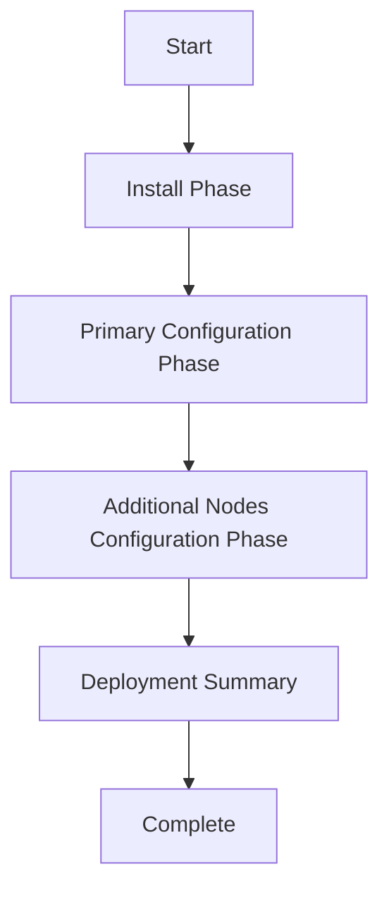

# PrivX Deployment Guide

This guide covers the unified PrivX deployment using the `deploy_privx.yml` playbook with tag-based execution control.

## Overview

The `deploy_privx.yml` playbook combines all PrivX deployment phases into a single, unified workflow:

1. **Installation Phase** - Install PrivX on all nodes
2. **Primary Configuration Phase** - Configure primary node and create backup
3. **Additional Nodes Configuration Phase** - Configure additional nodes using backup
4. **Deployment Completion** - Summary and next steps

## Tag-Based Execution

Use tags to control which phases to execute:

### Available Tags

| Tag | Description | Phases Included |
|-----|-------------|-----------------|
| `full_deployment` | Complete end-to-end deployment | All phases |
| `install` | Installation only | Repository setup, package installation |
| `configure` | Configuration only | Primary + additional nodes configuration |
| `configure_primary` | Primary node configuration only | Primary configuration + CA chain deployment |
| `configure_additional` | Additional nodes configuration only | Backup restoration on additional nodes |
| `deploy_ca_chain` | CA chain certificate deployment only | CA certificate upload and trust anchor update |
| `summary` | Deployment summary only | Completion summary and next steps |

## Deployment Scenarios

### Scenario 1: Complete Deployment (Recommended)

Deploy everything from scratch:

```bash
ansible-playbook -i inventory deploy_privx.yml \
  --tags full_deployment \
  -e privx_dns_name=privx.example.com \
  -e database_password=your_secure_password \
  -e postgres_address=db.example.com \
  -e superuser_password=your_admin_password
```

**What it does:**
- Installs PrivX on all nodes
- Configures primary node and creates backup
- Configures additional nodes using backup
- Displays completion summary

### Scenario 2: Installation Only

Install PrivX packages without configuration:

```bash
ansible-playbook -i inventory deploy_privx.yml --tags install
```

**Use case:** Prepare nodes for configuration later

### Scenario 3: Configuration Only

Configure already-installed PrivX nodes:

```bash
ansible-playbook -i inventory deploy_privx.yml \
  --tags configure \
  -e privx_dns_name=privx.example.com \
  -e database_password=your_secure_password \
  -e postgres_address=db.example.com \
  -e superuser_password=your_admin_password
```

**Use case:** Nodes are already installed, need configuration

### Scenario 4: Primary Configuration Only

Configure only the primary node:

```bash
ansible-playbook -i inventory deploy_privx.yml \
  --tags configure_primary \
  -e privx_dns_name=privx.example.com \
  -e database_password=your_secure_password \
  -e postgres_address=db.example.com \
  -e superuser_password=your_admin_password
```

**Use case:** Single-node deployment or primary-first approach

### Scenario 5: Additional Nodes Only

Configure additional nodes using existing backup:

```bash
ansible-playbook -i inventory deploy_privx.yml --tags configure_additional
```

**Use case:** Primary is configured, need to add more nodes

### Scenario 6: CA Chain Certificate Deployment Only

Deploy or update CA chain certificate on primary node:

```bash
# Place your CA chain certificate file
cp your-ca-chain.crt ./ca_chain.crt

# Deploy CA chain certificate only
ansible-playbook -i inventory deploy_privx.yml --tags deploy_ca_chain
```

**Prerequisites:**
- PrivX must be installed and configured on primary node
- CA chain certificate file must exist as `./ca_chain.crt`

**Use case:** Update SSL certificates after initial deployment

### Scenario 7: Extender Deployment

Deploy PrivX Extenders on dedicated nodes:

```bash
ansible-playbook -i inventory deploy_extender.yml
```

**Prerequisites:**
- Extender configuration files downloaded from PrivX UI
- Configuration files saved as `./configuration_files/<hostname>-extender-config.toml`

**Use case:** Add extenders to existing PrivX deployment

### Scenario 8: Complete Deployment with Extenders

Deploy PrivX core and extenders separately:

```bash
# Step 1: Deploy PrivX core
ansible-playbook -i inventory deploy_privx.yml \
  --tags full_deployment \
  -e privx_dns_name=privx.example.com \
  -e database_password=your_password \
  -e postgres_address=db.example.com \
  -e superuser_password=your_admin_password

# Step 2: Deploy extenders
ansible-playbook -i inventory deploy_extender.yml
```

**Use case:** Complete infrastructure deployment with optional components

### Scenario 9: WAG Deployment

Deploy PrivX Web Access Gateway components on dedicated nodes:

```bash
ansible-playbook -i inventory deploy_wag.yml
```

**Prerequisites:**
- WAG configuration files downloaded from PrivX UI
- Carrier configuration files saved as `./configuration_files/<hostname>-carrier-config.toml`
- Web Proxy configuration files saved as `./configuration_files/<hostname>-web-proxy-config.toml`

**Use case:** Add WAG components to existing PrivX deployment

### Scenario 10: Complete Deployment with WAG

Deploy PrivX core and WAG components separately:

```bash
# Step 1: Deploy PrivX core
ansible-playbook -i inventory deploy_privx.yml \
  --tags full_deployment \
  -e privx_dns_name=privx.example.com \
  -e database_password=your_password \
  -e postgres_address=db.example.com \
  -e superuser_password=your_admin_password

# Step 2: Deploy WAG components
ansible-playbook -i inventory deploy_wag.yml
```

**Use case:** Complete infrastructure deployment with HTTP/HTTPS access gateway

### Scenario 11: Complete Infrastructure Deployment

Deploy PrivX core, extenders, and WAG components:

```bash
# Step 1: Deploy PrivX core
ansible-playbook -i inventory deploy_privx.yml \
  --tags full_deployment \
  -e privx_dns_name=privx.example.com \
  -e database_password=your_password \
  -e postgres_address=db.example.com \
  -e superuser_password=your_admin_password

# Step 2: Deploy extenders
ansible-playbook -i inventory deploy_extender.yml

# Step 3: Deploy WAG components
ansible-playbook -i inventory deploy_wag.yml
```

**Use case:** Complete PrivX infrastructure with all optional components

### Scenario 12: Staged Deployment

Deploy in controlled stages:

```bash
# Stage 1: Install all nodes
ansible-playbook -i inventory deploy_privx.yml --tags install

# Stage 2: Configure primary node
ansible-playbook -i inventory deploy_privx.yml \
  --tags configure_primary \
  -e privx_dns_name=privx.example.com \
  -e database_password=your_secure_password \
  -e postgres_address=db.example.com \
  -e superuser_password=your_admin_password

# Stage 3: Validate primary node manually
# (Access web interface, test functionality)

# Stage 4: Configure additional nodes
ansible-playbook -i inventory deploy_privx.yml --tags configure_additional

# Stage 5: Install extenders (optional)
ansible-playbook -i inventory deploy_extender.yml

# Stage 6: View summary
ansible-playbook -i inventory deploy_privx.yml --tags summary
```

## Required Variables

### For Configuration Phases

These variables are required when running configuration tags:

| Variable | Description | Example |
|----------|-------------|---------|
| `privx_dns_name` | DNS name for PrivX | `privx.example.com` |
| `database_password` | Database user password | `SecurePassword123` |
| `postgres_address` | PostgreSQL server address | `db.example.com` |
| `superuser_password` | PrivX superuser password | `AdminPassword123` |

### Optional Variables

These variables have defaults but can be overridden:

| Variable | Default | Description |
|----------|---------|-------------|
| `privx_ips` | `""` | Specific IP addresses |
| `privx_superuser` | `admin` | Superuser name |
| `email_domain` | `example.com` | Email domain |
| `database_name` | `privx` | Database name |
| `database_username` | `privx` | Database username |
| `database_port` | `5432` | Database port |
| `database_sslmode` | `require` | Database-connection SSL mode |
| `postgres_ssl_cert_file` | `./privx-db-trust-anchor.pem` | PostgreSQL server certificate or CA certificate in PEM format  |


## Tag Combinations

### Multiple Tags

You can combine tags for custom execution:

```bash
# Install and configure primary only
ansible-playbook -i inventory deploy_privx.yml \
  --tags install,configure_primary \
  -e privx_dns_name=privx.example.com \
  -e database_password=your_password \
  -e postgres_address=db.example.com \
  -e superuser_password=your_admin_password

# Configure both primary and additional nodes
ansible-playbook -i inventory deploy_privx.yml \
  --tags configure_primary,configure_additional \
  -e privx_dns_name=privx.example.com \
  -e database_password=your_password \
  -e postgres_address=db.example.com \
  -e superuser_password=your_admin_password
```

### Skip Tags

Skip specific phases:

```bash
# Full deployment but skip summary
ansible-playbook -i inventory deploy_privx.yml \
  --tags full_deployment \
  --skip-tags summary \
  -e privx_dns_name=privx.example.com \
  -e database_password=your_password \
  -e postgres_address=db.example.com \
  -e superuser_password=your_admin_password
```

## Execution Flow

### Full Deployment Flow



### Phase Dependencies

- **Primary Configuration** requires **Installation** to be completed
- **Additional Nodes Configuration** requires **Primary Configuration** backup
- **Summary** can run independently to show current status

## Troubleshooting

### Common Issues

#### 1. Missing Required Variables
```bash
# Error: Required variables not provided
# Solution: Add required variables
ansible-playbook -i inventory deploy_privx.yml \
  --tags configure \
  -e privx_dns_name=your_dns_name \
  -e database_password=your_password \
  -e postgres_address=your_db_server
```

#### 2. Backup Not Found for Additional Nodes
```bash
# Error: Backup archive not found
# Solution: Run primary configuration first
ansible-playbook -i inventory deploy_privx.yml --tags configure_primary -e ...
```

#### 3. PrivX Not Installed
```bash
# Error: PrivX not installed on nodes
# Solution: Run installation first
ansible-playbook -i inventory deploy_privx.yml --tags install
```

### Debug Mode

Run with verbose output for troubleshooting:

```bash
ansible-playbook -i inventory deploy_privx.yml \
  --tags full_deployment \
  -e privx_dns_name=privx.example.com \
  -e database_password=your_password \
  -e postgres_address=db.example.com \
  -e superuser_password=your_admin_password \
  -vvv
```

### Check Mode

Test what would be executed without making changes:

```bash
ansible-playbook -i inventory deploy_privx.yml \
  --tags full_deployment \
  --check \
  -e privx_dns_name=privx.example.com \
  -e database_password=your_password \
  -e postgres_address=db.example.com \
  -e superuser_password=your_admin_password
```

## Best Practices

### Production Deployments

1. **Use staged deployment** for production environments
2. **Test in development** environment first
3. **Validate each phase** before proceeding
4. **Keep backups** of configuration and database
5. **Monitor logs** during deployment

### Development/Testing

1. **Use full_deployment** tag for quick setup
2. **Use check mode** to validate playbooks
3. **Use verbose mode** for troubleshooting

### Maintenance

1. **Use specific tags** for targeted updates
2. **Keep deployment documentation** updated
3. **Test tag combinations** before production use

## Migration from Previous Versions

If you were using individual playbooks in previous versions, here's the migration:

| Old Command | New Command |
|-------------|-------------|
| `ansible-playbook install_privx.yml` | `ansible-playbook deploy_privx.yml --tags install` |
| `ansible-playbook configure_privx.yml -e ...` | `ansible-playbook deploy_privx.yml --tags configure_primary -e ...` |
| `ansible-playbook configure_additional_nodes.yml` | `ansible-playbook deploy_privx.yml --tags configure_additional` |
| All three in sequence | `ansible-playbook deploy_privx.yml --tags full_deployment -e ...` |

The individual playbook functionality is now integrated into the unified deployment playbook with improved consistency and maintainability.